<div align="center">

# 🎌 AnimeVerse — AWS DevSecOps CI/CD Pipeline

### Secure CI/CD for a containerized Flask application using Jenkins, SonarQube, Trivy, Docker, Amazon ECR, ECS Fargate, ALB and CloudWatch

[](https://www.python.org/)
[](https://flask.palletsprojects.com/)
[](https://www.docker.com/)
[](https://www.jenkins.io/)
[](https://www.sonarsource.com/products/sonarqube/)
[](https://trivy.dev/)
[](https://aws.amazon.com/)

</div>

---

## 📌 Project Overview

**AnimeVerse** is a Flask-based anime wallpaper web application used to demonstrate an end-to-end **DevSecOps CI/CD workflow on AWS**.

The project automates the software delivery lifecycle from source-code checkout and testing to code-quality analysis, container image creation, vulnerability scanning, image storage, cloud deployment and runtime logging.

### What this project demonstrates

- Source-code management using **GitHub**
- CI/CD orchestration using **Jenkins**
- Automated testing using **Pytest**
- Static code-quality analysis using **SonarQube**
- Containerization using **Docker**
- Container vulnerability scanning using **Trivy**
- Docker image storage using **Amazon ECR**
- Container deployment using **Amazon ECS Fargate**
- Public application access using an **Application Load Balancer**
- Runtime logging using **Amazon CloudWatch**
- AWS permissions using **IAM**

---

## 🏗️ Architecture

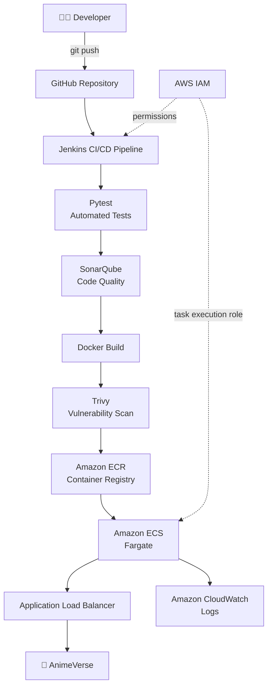

### End-to-End Flow

```text
Developer
   ↓
GitHub
   ↓
Jenkins
   ↓
Pytest
   ↓
SonarQube
   ↓
Docker Build
   ↓
Trivy Security Scan
   ↓
Amazon ECR
   ↓
Amazon ECS Fargate
   ↓
Application Load Balancer
   ↓
AnimeVerse
   ↓
CloudWatch Logs
```

---

## 🛠️ Technology Stack

| Layer | Technology | Purpose |
|---|---|---|
| Application | Python + Flask | Web application |
| Frontend | HTML, CSS, JavaScript | Anime wallpaper interface |
| Source Control | Git + GitHub | Version control |
| CI/CD | Jenkins | Pipeline orchestration |
| Testing | Pytest | Automated application testing |
| Code Quality | SonarQube | Static analysis and quality gate |
| Containerization | Docker | Application container |
| Security | Trivy | Container vulnerability scanning |
| Registry | Amazon ECR | Docker image repository |
| Orchestration | Amazon ECS | Container service management |
| Compute | AWS Fargate | Serverless container runtime |
| Traffic | Application Load Balancer | HTTP traffic routing |
| Logging | Amazon CloudWatch | Runtime logs |
| Access Control | AWS IAM | AWS permissions |

---

## ✨ AnimeVerse Application

AnimeVerse provides a dark-themed interface for browsing and downloading anime wallpapers.

### Current categories

- Demon Slayer
- Jujutsu Kaisen
- Tokyo Revengers
- Wind Breaker

### Application features

- Category-based wallpaper browsing
- Search and filtering
- Local image serving
- Download functionality
- JSON API
- Health-check endpoint
- Responsive UI

### Deployed Application

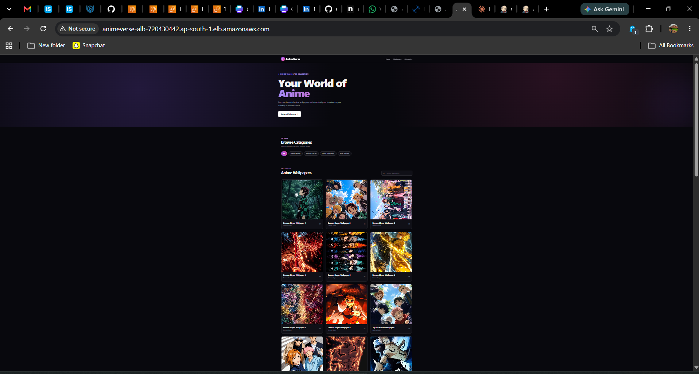

> The AWS environment can be removed after project documentation is complete to avoid unnecessary cloud charges.

---

## 🎥 Deployment Demo

AnimeVerse running through:

**ECS Fargate → Application Load Balancer → Browser**

[▶️ Watch the AnimeVerse ECS deployment demo](screenshots/application/animeverse-ecs-deployment-demo.mp4)

---

## 📂 Repository Structure

```text
animeverse-devsecops/
│
├── app/
│   ├── app.py
│   ├── templates/
│   │   └── index.html
│   └── static/
│       ├── css/
│       ├── js/
│       └── images/
│           ├── demon-slayer/
│           ├── jujutsu-kaisen/
│           ├── tokyo-revengers/
│           └── wind-breaker/
│
├── tests/
│   └── test_app.py
│
├── screenshots/
│   ├── application/
│   ├── jenkins/
│   ├── sonarqube/
│   ├── ecr/
│   ├── ecs/
│   ├── alb/
│   └── cloudwatch/
│
├── jenkins/
├── scripts/
├── Dockerfile
├── Jenkinsfile
├── requirements.txt
├── sonar-project.properties
├── .dockerignore
├── .gitignore
└── README.md
```

---

# 🔄 Jenkins DevSecOps CI/CD Pipeline

The project uses a **Jenkinsfile** to define the CI/CD workflow as code.

## Pipeline stages

### 1️⃣ Checkout Source Code

Jenkins retrieves the latest AnimeVerse source from GitHub.

```text
GitHub → Jenkins
```

---

### 2️⃣ Setup Python Environment

Jenkins creates an isolated Python environment and installs project dependencies from:

```text
requirements.txt
```

Example:

```bash
python3 -m venv .jenkins-venv
```

---

### 3️⃣ Run Automated Tests

Application tests are executed using **Pytest**:

```bash
pytest -v
```

The pipeline validates application behavior before container publication.

---

### 4️⃣ SonarQube Analysis

The source code is analyzed with **SonarQube**.

SonarQube provides visibility into:

- Bugs
- Reliability issues
- Maintainability
- Code smells
- Security-related findings
- Quality-gate status

### SonarQube Quality Gate

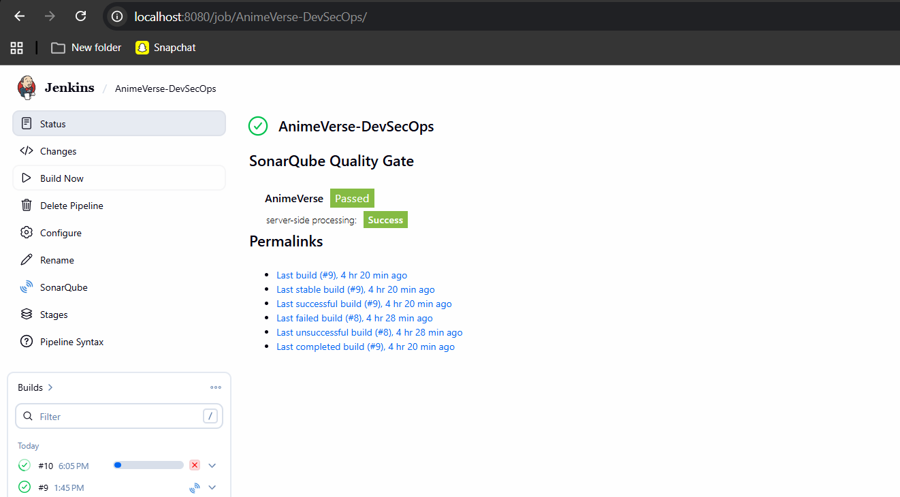

---

### 5️⃣ Build Docker Image

After testing and source analysis, Jenkins packages AnimeVerse into a Docker image.

Example:

```bash
docker build -t animeverse:${BUILD_NUMBER} .
```

Using build-number tags makes container images easier to trace back to CI runs.

---

### 6️⃣ Trivy Security Scan

The Docker image is scanned with **Trivy** before it is published.

Example:

```bash
trivy image \
  --scanners vuln \
  --severity HIGH,CRITICAL \
  --ignore-unfixed \
  animeverse:${BUILD_NUMBER}
```

This introduces a container-security checkpoint into the delivery pipeline.

---

### 7️⃣ Push Image to Amazon ECR

Jenkins authenticates with Amazon ECR and pushes the built image.

Typical image format:

```text
<AWS_ACCOUNT_ID>.dkr.ecr.ap-south-1.amazonaws.com/animeverse:<BUILD_NUMBER>
```

The workflow also maintains a `latest` tag.

### ECR Push

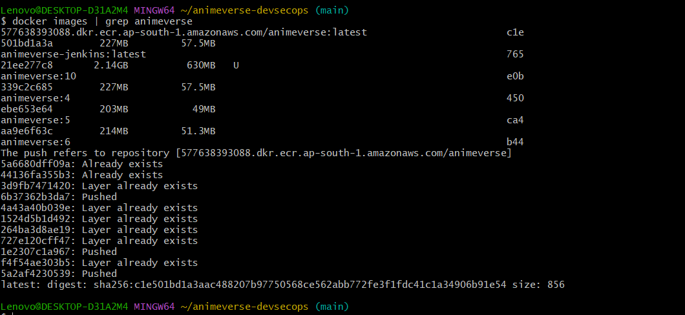

### Images Stored in ECR

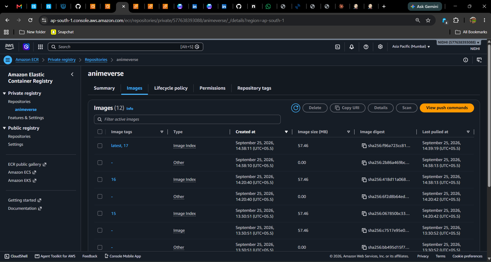

---

### 8️⃣ Deploy to Amazon ECS Fargate

The ECR image is used by the AnimeVerse ECS service.

```text
Amazon ECR
    ↓
ECS Task Definition
    ↓
ECS Service
    ↓
AWS Fargate Task
```

### ECS Deployment

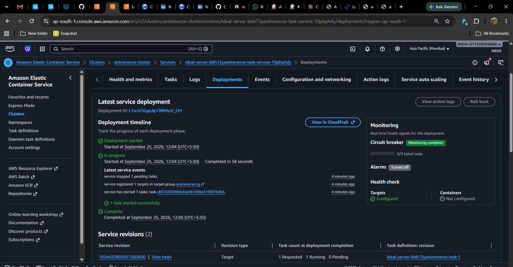

### ECS Service Health

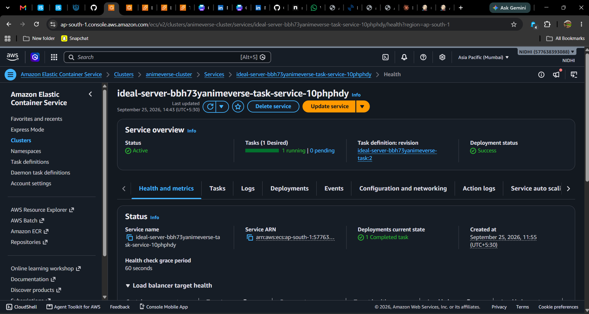

### Running ECS Container

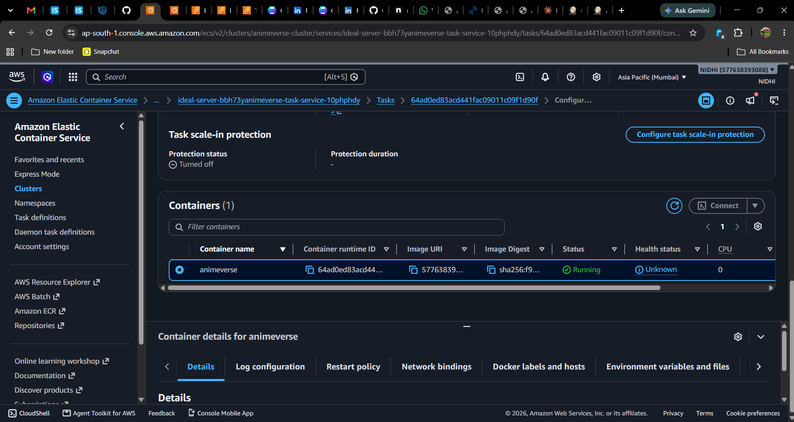

---

## ✅ Jenkins Pipeline Result

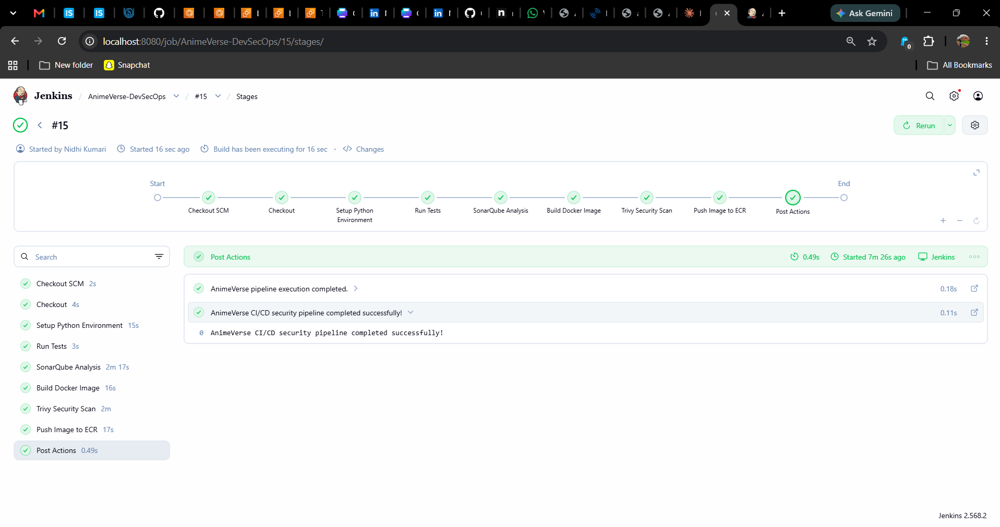

The pipeline demonstrates the following delivery chain:

```text
Checkout SCM
      ↓
Checkout
      ↓
Setup Python Environment
      ↓
Run Tests
      ↓
SonarQube Analysis
      ↓
Build Docker Image
      ↓
Trivy Security Scan
      ↓
Push Image to ECR
      ↓
Deployment / Post Actions
```

---

# ☁️ AWS Deployment Architecture

## Amazon ECR

The private **Amazon ECR** repository stores AnimeVerse Docker images created by the pipeline.

Repository:

```text
animeverse
```

Build-specific tags and `latest` provide traceability between CI runs and deployable artifacts.

---

## Amazon ECS + AWS Fargate

AnimeVerse runs as a containerized workload using **Amazon ECS** with **AWS Fargate**.

The ECS service handles:

- Desired task count
- Task revisions
- Container replacement during deployment
- Registration with the load balancer target group
- Service availability

---

## Application Load Balancer

AnimeVerse is exposed through an **Application Load Balancer**.

```text
Internet
   ↓
Application Load Balancer :80
   ↓
Target Group
   ↓
ECS Fargate Task :8000
   ↓
AnimeVerse
```

### Healthy ALB Target

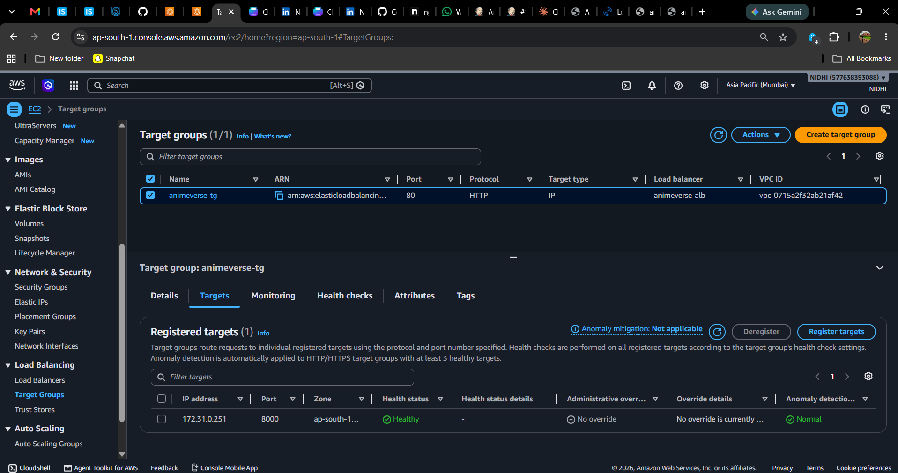

---

# ❤️ Health Check

AnimeVerse provides:

```text
/health
```

Example:

```json
{
  "application": "AnimeVerse",
  "status": "healthy"
}
```

### Application Health Endpoint

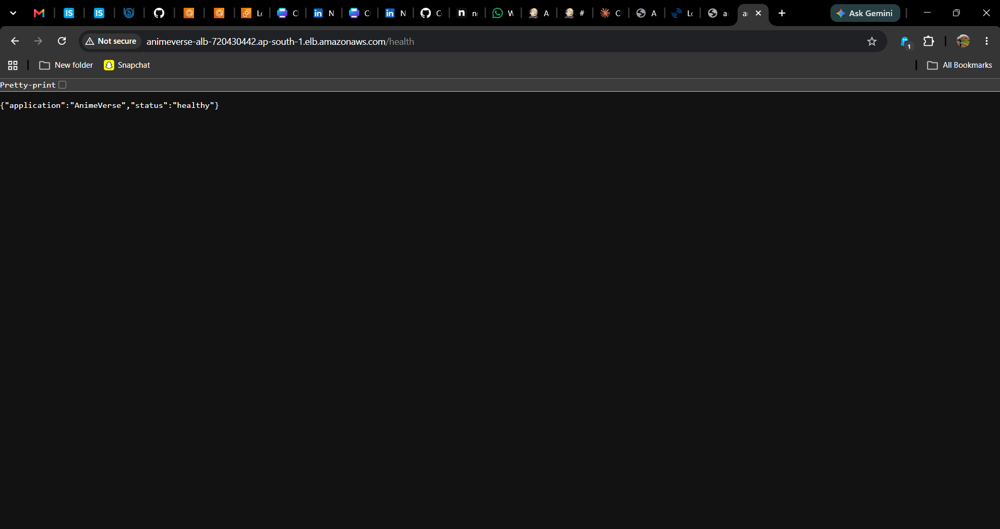

---

# 📊 Logging and Observability

Runtime logging is integrated with **Amazon CloudWatch Logs**.

CloudWatch provides centralized visibility into application and ECS task output.

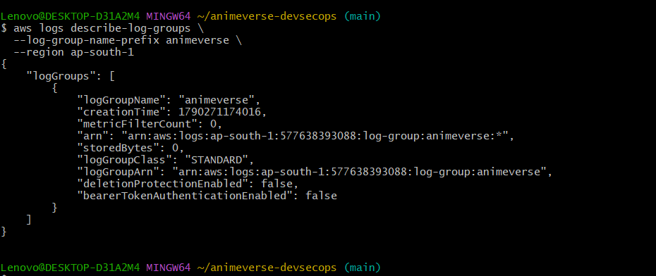

---

# 🔐 DevSecOps Security

Security checks are built into the delivery process:

```text
Source Code
    ↓
Pytest
    ↓
SonarQube
    ↓
Docker Image
    ↓
Trivy
    ↓
Amazon ECR
    ↓
ECS Fargate
```

## SonarQube

Used for source-code analysis and quality-gate validation.

## Trivy

Used for Docker image vulnerability scanning, focusing on **HIGH** and **CRITICAL** findings.

## Jenkins Credentials

Sensitive credentials belong in Jenkins credential storage rather than the source repository.

Typical logical credential IDs:

```text
aws-credentials
sonarqube-token
```

## AWS IAM

IAM enables the CI/CD and runtime components to access services such as:

- Amazon ECR
- Amazon ECS
- CloudWatch
- Elastic Load Balancing

> Never commit AWS access keys, secret keys, passwords, tokens or private keys to GitHub.

---

# 🐳 Docker

AnimeVerse is containerized using Docker and served with Gunicorn.

```text
Flask Application
      ↓
Docker Image
      ↓
Gunicorn
      ↓
Port 8000
```

Build:

```bash
docker build -t animeverse .
```

Run:

```bash
docker run -d \
  --name animeverse \
  -p 8000:8000 \
  animeverse
```

Open:

```text
http://localhost:8000
```

---

# 💻 Run AnimeVerse Locally

## Clone

```bash
git clone https://github.com/Nidhi8901/animeverse-devsecops.git
cd animeverse-devsecops
```

## Create Virtual Environment

```bash
python -m venv venv
```

Git Bash:

```bash
source venv/Scripts/activate
```

## Install Dependencies

```bash
pip install -r requirements.txt
```

## Run Tests

```bash
pytest -v
```

## Run Application

```bash
python app/app.py
```

Open:

```text
http://localhost:8000
```

Health check:

```text
http://localhost:8000/health
```

---

# 🔍 Run Trivy Locally

```bash
trivy image \
  --scanners vuln \
  --severity HIGH,CRITICAL \
  --ignore-unfixed \
  animeverse
```

---

# ⚙️ Jenkins Requirements

The Jenkins environment requires:

- Git
- Docker
- Python 3
- AWS CLI
- Trivy
- SonarQube integration
- Jenkins Pipeline support
- Credentials Binding
- AWS credentials configured securely

---

# 🔑 Jenkins Credentials

| Credential | Purpose |
|---|---|
| `aws-credentials` | AWS authentication for ECR/ECS operations |
| `sonarqube-token` | SonarQube authentication |
| GitHub/SCM credentials | Repository checkout when required |

Credentials should be stored in Jenkins and not committed to source control.

---

# 🧪 Testing

AnimeVerse uses **Pytest**:

```bash
pytest -v
```

Tests execute before image publication so application problems can be caught early.

---

# 📊 DevSecOps Pipeline Summary

| Stage | Tool / Service | Purpose |
|---|---|---|
| Source | GitHub | Source-code management |
| CI/CD | Jenkins | Pipeline orchestration |
| Testing | Pytest | Automated validation |
| Code Quality | SonarQube | Static analysis and quality gate |
| Build | Docker | Container image creation |
| Security | Trivy | Vulnerability scanning |
| Registry | Amazon ECR | Docker image storage |
| Deployment | Amazon ECS | Container orchestration |
| Runtime | AWS Fargate | Serverless container compute |
| Traffic | ALB | HTTP traffic routing |
| Health | `/health` | Availability validation |
| Logging | CloudWatch | Runtime logs |
| Access | IAM | AWS authorization |

---

# 📸 Project Evidence

The repository includes screenshots documenting:

- AnimeVerse deployed through AWS
- Jenkins pipeline execution
- SonarQube quality gate
- Docker image push to ECR
- ECR image versions
- ECS deployment
- ECS running container
- ECS service health
- ALB healthy target
- Application health endpoint
- CloudWatch logging

All evidence is stored under:

```text
screenshots/
```

---

# 🧹 AWS Resource Cleanup

AWS resources may incur charges while active.

After completing testing and capturing project evidence, resources can be removed if no longer needed.

Typical cleanup includes:

- ECS service and tasks
- ECS cluster
- Application Load Balancer
- Target group
- ECR images/repository if no longer required
- CloudWatch log groups if desired
- Temporary IAM resources created for the project

> Verify dependencies before deleting cloud resources.

The source code, Dockerfile, Jenkinsfile, screenshots and README remain available in GitHub as portfolio evidence after cleanup.

---

# 🎯 Key Learnings

This project demonstrates:

- Continuous Integration
- Continuous Delivery / Deployment workflow
- Pipeline as Code
- Git-based development
- Automated testing
- Static code analysis
- Containerization
- Container vulnerability scanning
- Secure credential management
- Container registries
- AWS ECS and Fargate
- Load balancing
- Health checks
- Centralized logging
- IAM-based authorization
- Cloud deployment troubleshooting

---

# 🚀 Project Outcome

AnimeVerse demonstrates a complete DevSecOps delivery lifecycle:

```text
Code
  ↓
Test
  ↓
Analyze
  ↓
Build
  ↓
Scan
  ↓
Publish
  ↓
Deploy
  ↓
Monitor
```

The project shows how application delivery, automation and security controls can be integrated into one repeatable CI/CD workflow.

---

# 👩‍💻 Author

**Nidhi Kumari**

DevOps | Cloud | DevSecOps

GitHub: [Nidhi8901](https://github.com/Nidhi8901)

Project: [AnimeVerse DevSecOps](https://github.com/Nidhi8901/animeverse-devsecops)

---

<div align="center">

### ⭐ AnimeVerse DevSecOps

If you find this project useful, feel free to explore the repository and the CI/CD implementation.

</div>
